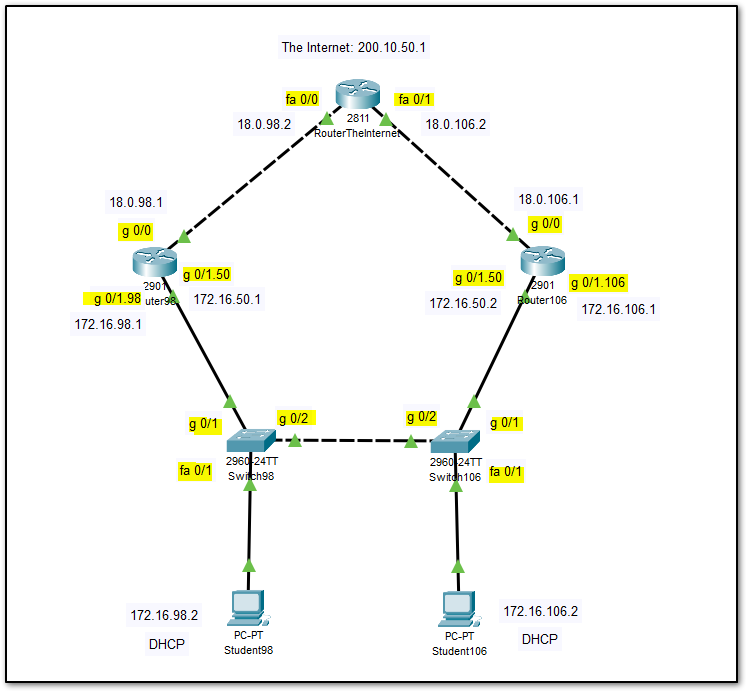

## Network Diagram

- Make connections as per the diagram.
1. Make connections as per the diagram. **Make sure to talk with everyone sharing the pod, on who is using which devices**.
2. Make the following configuration in the switch (**switch-98**)
```cisco
!Configure switch with unique hostname, IPs containing Unique ID and configure for SSH access
en
conf t
hostname Switch-98
ip domain-name csn400.com
enable password seneca
!
vtp mode server
vtp domain student98
vlan 98
vlan 50
vlan 106
vlan 99
!
int fa 0/1
switchport access vlan 98
spanning-tree portfast
spanning-tree bpduguard enable
!
int range fa 0/2 - 24
switchport access vlan 99
spanning-tree portfast
spanning-tree bpduguard enable
!
int gig 0/1
switchport mode trunk
switchport trunk allowed vlan 98,50,106
!
int gig 0/2
switchport mode trunk
switchport trunk allowed vlan 98,50,106
!
int vlan 50
ip address 172.16.50.98 255.255.255.0
exit
!
ip default-gateway 172.16.50.1
!

```
3. Enable SSH to the switch (**switch-98**)
```cisco
!SSH setup script -- run this script separately!
crypto key generate rsa
1024
ip ssh version 2
line vty 0 4
transport input ssh 
login local
username student98 password csn400
exit
```
4. Config the router (**router-98**)
```cisco
en
conf t
hostname Router-98
ip domain-name csn400.com
enable password seneca
!
int gig 0/0
ip address 18.0.98.1 255.255.255.252
ip nat outside
no shut
!
int gig 0/1
no shut
!
int gig 0/1.98
ip nat inside
encapsulation dot1q 98
ip address 172.16.98.1 255.255.255.0
!
!This will be the administrative Vlan/Gateway for all networking devices on both sides of the network
int gig 0/1.50
encapsulation dot1q 50
ip address 172.16.50.1 255.255.255.0
!
ip dhcp pool net98
network 172.16.98.0 255.255.255.0
default-router 172.16.98.1
ip dhcp excluded-address 172.16.98.1
!
router ospf 1
network 172.16.98.0 255.255.255.0 area 0
network 172.16.50.0 255.255.255.0 area 0
exit
!
!WHAT IS THE NEXT LINE
ip route 0.0.0.0 0.0.0.0 18.0.98.2
!
!WHAT IS THIS
access-list 1 permit 172.16.98.0 0.0.0.255
ip nat inside source list 1 int gig 0/0 overload
!
```
5. Enable ssh (**router-98**)
```log
!SSH setup script -- run this script separately!
crypto key generate rsa
1024
ip ssh version 2
line vty 0 4
transport input ssh 
login local
username student98 password csn400
exit
```
6. Ensure that the partner has configured his router and switch properly.
8. Configure VMWARE, networks to have on VNET briding to the NIC connected to the back, and one NIC connected to the network.
9. Configure VM settings to have two networks adapters, and chose VNETS accordingly.
	- Ensure you can ping the router
	- Ensure you can access the internet
		- Have a look at the routing table if cannot access the internet. Delete the routing entry starting with 172.16.98.0.
		- Add, delete routing tables as necessary. 

10. Ensure SSH connection from pc to switch and to the router.
11. Ensure that the partner is able to step 9 & 10 in his side as well.
12. Try pinging to partner pc, using his/her IP.
13. Else, troubleshoot. 

##  Partners Config
- These settings are for a 2800 series router.
- Replace `fa` to `g` if using a 2900 series router. No changes to switch config required.
- **Router Config**
```log
!
en
conf t
hostname Router-106
ip domain-name csn400.com
enable password seneca
!
int gig 0/0
ip nat outside
ip address 18.0.106.1 255.255.255.252
no shut
!
int gig 0/1
no shut
!
int gig 0/1.106
ip nat inside
encapsulation dot1q 106
ip address 172.16.106.1 255.255.255.0
!
int gig 0/1.50
encapsulation dot1q 50
ip address 172.16.50.2 255.255.255.0
!
ip dhcp pool net106
network 172.16.106.0 255.255.255.0
default-router 172.16.106.1
ip dhcp excluded-address 172.16.106.1
!
router ospf 1
network 172.16.106.0 255.255.255.0 area 0
network 172.16.50.0 255.255.255.0 area 0
exit
!
!WHAT IS THE NEXT LINE
ip route 0.0.0.0 0.0.0.0 18.0.106.2
!
!WHAT IS THIS
access-list 1 permit 172.16.106.0 0.0.0.255
ip nat inside source list 1 int gig 0/0 overload
!
!SSH setup script -- run this script separately!
crypto key generate rsa
1024
ip ssh version 2
line vty 0 4
transport input ssh 
login local
username student106 password csn400
exit

```

- **Switch Config**
```

!Configure switch with unique hostname, IPs containing Unique ID and configure for SSH access
en
conf t
hostname Switch-106
ip domain-name csn400.com
enable password seneca
!
vtp mode client
vtp domain student98
!
int fa 0/1
switchport access vlan 106
spanning-tree portfast
spanning-tree bpduguard enable
!
int range fa 0/2 - 24
switchport access vlan 99
spanning-tree portfast
spanning-tree bpduguard enable
!
int gig 0/1
switchport mode trunk
switchport trunk allowed vlan 98,50,106
!
int gig 0/2
switchport mode trunk
switchport trunk allowed vlan 98,50,106
!
int vlan 50
ip address 172.16.50.106 255.255.255.0
exit
!
ip default-gateway 172.16.50.1
!
!SSH setup script -- run this script separately!
crypto key generate rsa
1024
ip ssh version 2
line vty 0 4
transport input ssh 
login local
username student106 password csn400
exit
```

## The_Internet

```cisco
en
conf t
int fa 0/0
ip access-group 110 in
ip address 18.0.98.2 255.255.255.252
no shut
!
int fa 0/1
ip access-group 110 in
ip address 18.0.106.2 255.255.255.252
no shut
!
int lo0
ip address 200.100.50.1 255.255.255.255
no shut
exit
!
access-list 110 deny ip 172.16.0.0 0.0.255.255 any
access-list 110 permit ip any any
!
ip route 172.16.106.0 255.255.255.0 fa 0/1
ip route 172.16.98.0 255.255.255.0 fa 0/0
!
```

# Visual Inspection Lab 4

Optional:  Start Wireshark and capture all traffic on the network interface that is connected to the back room (NOTE:  If you don't do this now, you will have to do it later, repeat the tests in the VI and catch all of this traffic.)

Perform the following actions from your Ubuntu VM:

SSH into your partner's Switch
SSH into your partner's Router
Ping your partner's Ubuntu Host

If you did not run wireshark at the beginning of this inspection, you must run it now and re-do the inspection to capture the packets.

# Post Lab 4 Submission 

Submit a FILTERED .pcap file from the .pcap file created during your visual inspection that contains only the following packets:

An OSPF packet sent from your Router (1 packet)

A ping request/response from your Ubuntu Host to 200.100.50.1 (2 Packets)
A ping request/response from your Ubuntu Host to your partner's Ubuntu Host (2 Packets)


SCREENSHOTS:

Take screenshots of the output of each of the following commands from your Router:

sh ip ospf interface
sh ip ospf neigbor
sh ip ospf database


DO NOT COMPRESS FILES(.zip, .7z, .rar, etc) INCLUDE EACH FILE INDIVIDUALLY OR ALTERNATIVELY, YOU MAY COMBINE ALL SCREENSHOTS INTO A SINGLE WORD DOCUMENT AND SUBMIT THE .docx FILE.
